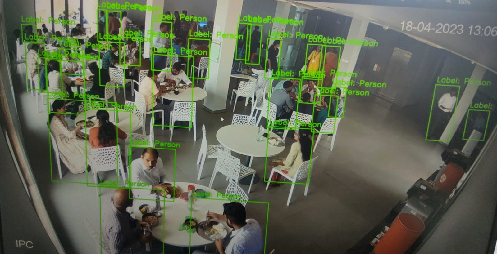
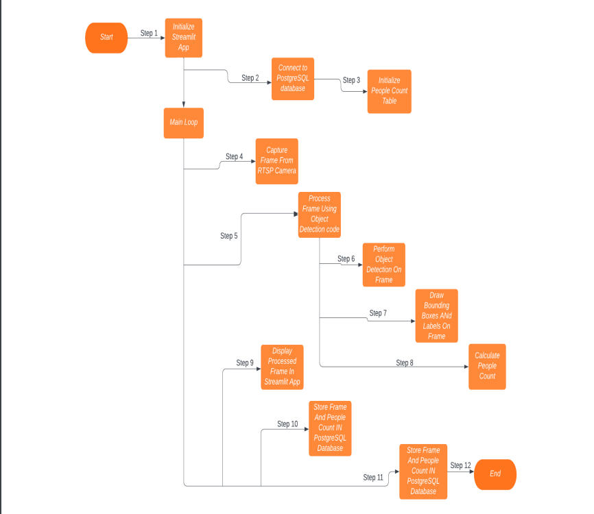

# Human Presence Monitoring System 

## Human Detection using RTSP Camera

Human detection using an RTSP (Real Time Streaming Protocol) camera involves the real-time analysis of video data to identify and track human presence. Advanced algorithms analyze shapes, contours, and patterns within the video stream to detect potential human regions. Machine learning techniques are often employed to enhance accuracy and robustness in identifying humans amidst varying environmental conditions.

### Applications:

- **Surveillance Systems:** RTSP-based human detection is widely used in surveillance systems to monitor and detect unauthorized human presence in restricted areas.
  
- **Security:** It plays a crucial role in enhancing security measures by automatically detecting and alerting security personnel to suspicious human activity.
  
- **Smart Homes:** Human detection using RTSP cameras contributes to smart home automation, enabling systems to recognize and respond to human presence for various applications like automated lighting, temperature control, and security.
  
- **Crowd Monitoring:** In crowded environments such as public spaces or events, RTSP-based human detection aids in crowd monitoring and management by identifying human presence and analyzing crowd dynamics.
  
- **Automation:** By leveraging computer vision algorithms and the continuous video stream from an RTSP camera, human detection automates the identification of humans in diverse environments, providing enhanced situational awareness and facilitating rapid response to potential threats or incidents.

### Benefits:

- **Real-time Detection:** RTSP-based human detection offers real-time monitoring capabilities, allowing for immediate response to detected human presence.
  
- **Enhanced Security:** It enhances security measures by providing continuous surveillance and automated detection of unauthorized human activity.
  
- **Versatility:** The technology can be applied across various domains, including home security, commercial surveillance, public safety, and more.
  
- **Automation:** Human detection using RTSP cameras automates the process of identifying and tracking humans, reducing the need for manual intervention in surveillance and security operations.

### Working Flowchart

  
### Project Requirements

- **numpy==1.22.4**
- **opencv_python==4.7.0.72**
- **psycopg2==2.9.6**
- **streamlit==1.24.0**

These are the required Python packages and their respective versions needed for the project.

